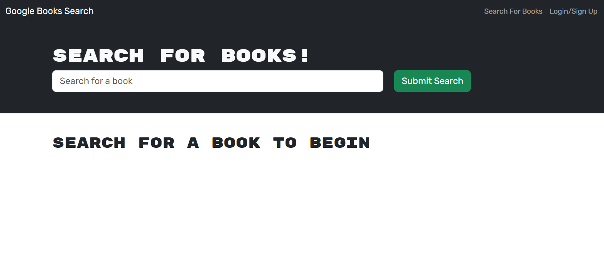
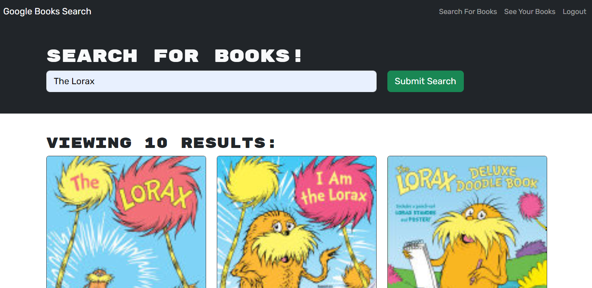

  

  # Googlebooks-API

  ## Description
  
  This repositoy contains the refactored files for a Googlebooks API. Using Mongodb, Mongoose, Express.js API, React, and Node JS, users of this app can search through the Google books API to find books of interest and add them to their collection of saved titles for later reading. The app itself, originally built with a RESTful API, has been converted to a Graphql API built with Apollo Server.

  ## Table of Contents

- [Installation](#installation)
- [Usage](#usage)
- [License](#license)
- [Contributing](#contribution)
- [Tests](#tests)
- [Questions](#questions)

## Installation

Go to https://github.com/joaqsala/googlebooks-api and clone the repository. Open the contents in VS Code or similar editor. In the terminal, install all dependencies using npm i. Start the app using npm run develop.

## Usage 

Follow the steps in the installation instructions posted above, and type npm run develop in the editor terminal. A browser window should open allowing you to search for any book by title. The book search will return the book information that includes the title, author, description, bookId, and a thumbnail image. Users can also create a profile and login to save the searched books to their personal reading list. Books can also be removed from the reading list once the book has been read. Happy Reading!

## License

This project is covered under the MIT License.
 
  https://opensource.org/license/mit/

## Contribution

Contributions are always welcomed. Please submit a pull request.

## Tests

Test the app by creating profiles and searching for books to add and remove books from their personal reading list.

## Questions

For any questions, please feel free to reach out. 

Github username: https://github.com/joaqsala

Email: joaqsala@gmail.com
